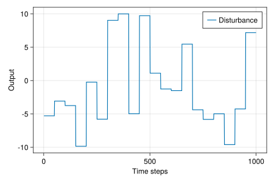

# (Convex) Nonlinear Control with REN

*This example was first presented in Section IX of [Revay, Wang & Manchester (2021)](https://ieeexplore.ieee.org/document/10179161). Full example code can be found [here](https://github.com/acfr/RobustNeuralNetworks.jl/blob/main/examples/src/echo_ren.jl).*


RENs and LBDNs can be used for a lot more than just learning-based problems. In this example, we'll see how RENs can be used to design nonlinear feedback controllers with stability guarantees for linear dynamical systems with constraints. Introducing constraints (eg: minimum/maximum control inputs) often means that nonlinear controllers perform better than linear policies. A common approach is to use *Model Predictive Control* ([MPC](https://en.wikipedia.org/wiki/Model_predictive_control)). In our case, we'll use convex optimisation to design a nonlinear controller. The controller will be an [*echo state network*](https://en.wikipedia.org/wiki/Echo_state_network) based on a contracting REN. We'll use this alongside the [*Youla-Kucera parameterisation*](https://www.sciencedirect.com/science/article/pii/S1367578820300249) to guarantee stability of the final controller.

For a detailed explanation of the theory behind this example, please read Section IX of the original [paper](https://ieeexplore.ieee.org/document/10179161). For more on using RENs with the Youla parameterisation, see [Wang et al. (2022)](https://ieeexplore.ieee.org/abstract/document/9802667) and [Barbara, Wang & Manchester (2023)](https://doi.org/10.48550/arXiv.2304.06193).


## 1. Background theory

### Stabilising a linear system

We'll start with some background on the structure of linear systems and output-feedback controllers. Consider a discrete-time linear system with state vector ``x_t``, control signal ``u_t``, external inputs ``d_t``, measured output ``y_t,`` and some performance variable ``z_t`` to be kept small.

```math
\begin{aligned}
x_{t+1} &= \mathbb{A}x_t + \mathbb{B_1} d_t + \mathbb{B_2} u_t \\
z_t &= \mathbb{C_1} x_t + \mathbb{D_{11}} d_t + \mathbb{D_{12}} u_t \\
y_t &= \mathbb{C_2} x_t + \mathbb{D_{21}} d_t
\end{aligned}
```

A typical choice of stabilising controller is an output-feedback structure with state estimate ``\hat{x}_t`` and observer/controller gain matrices ``L`` and ``K``, respectively.

```math
\begin{aligned}
\hat{x}_{t+1} &= \mathbb{A}\hat{x}_t + \mathbb{B_2} u_t + L \tilde{y}_t \\
\tilde{y}_t &= y_t - \mathbb{C_2} \hat{x}_t \\
u_t &= -K\hat{x}_t + \tilde{u}_t
\end{aligned}
```

We have also included an additional signal ``\tilde{u}_t`` to augment the control inputs ``u_t.`` With a little bit of algebra, the closed-loop dynamics of the system can be written in the following form, where ``\mathcal{T}_0, \mathcal{T}_1, \mathcal{T}_2`` are linear systems.

```math
\begin{bmatrix}
z \\ \tilde{y}
\end{bmatrix}
= 
\begin{bmatrix}
\mathcal{T}_0 & \mathcal{T}_1 \\ \mathcal{T}_2 & 0
\end{bmatrix}
\begin{bmatrix}
d \\ \tilde{u}
\end{bmatrix}
```

Notice that there is no coupling between ``\tilde{y}`` and ``\tilde{u}``. 

### Controller augmentation

The linear controller will stabilise our linear dynamical system in the absence of any constraints. But what if we want to shape the closed-loop response to meet some user-defined design criteria without losing stability? For example, what if we want to keep the control signal in some safe range ``u_\mathrm{min} < u_t < u_\mathrm{max}`` at all times?

It turns out that if we augment the original controller with ``\tilde{u} = \mathcal{Q}(\tilde{y})`` where ``\mathcal{Q}`` is a [*contracting system*](https://fbullo.github.io/ctds/) then the closed-loop system is guaranteed to remain stable. This is incredibly useful for optimal control design. For example, we could use a contracting REN as our parameter ``\mathcal{Q}`` and optimise it to meet some performance specifications (like control constrains), knowing that final closed-loop system is guaranteed to be stable. The closed-loop response can be written as follows.

```math
z = \mathcal{T}_0 d + \mathcal{T}_1 \mathcal{Q}(\mathcal{T}_2 d)
```

This is an old idea in linear control theory called the Youla-Kucera parameterisation. We extended it to nonlinear models (like RENs) and nonlinear dynamical systems in [Wang et al. (2022)](https://ieeexplore.ieee.org/abstract/document/9802667) and [Barbara, Wang & Manchester (2023)](https://doi.org/10.48550/arXiv.2304.06193), respectively.


### Echo state networks with REN

Now that we've decided on a structure for our control framework, we need a way to create and optimise a contracting ``\mathcal{Q}`` to meet our design criteria. We could directly use a contracting REN for ``\mathcal{Q}`` and train it with reinforcement learning, thereby [learning over the space of all stabilising controllers](https://ieeexplore.ieee.org/abstract/document/9802667)  for this linear system. While it's very useful to have this option, sometimes we'll want a more efficient solution. Enter convex optimisation with echo state networks.

Let's say ``\mathcal{Q}`` has learnable parameters ``\theta``. Suppose our problem is to minimise some convex objective function ``J(z)`` subject to a set of convex constraints. I.e:

```math
\min_\theta J(z) \quad \text{s.t.} \quad c(z) \le 0
```

An [*echo state network*](https://en.wikipedia.org/wiki/Echo_state_network) is a dynamic model with randomly sampled but *fixed* dynamics and a learnable output map. We can create *contracting* echo state networks ``\mathcal{Q}`` with contracting RENs. When a REN model is called, it can be viewed as a system with the following form (see [`ExplicitRENParams`](@ref)).

```math
\begin{equation*}
\begin{bmatrix}
\bar{x}_{t+1} \\ v_t \\ \bar{y}_t
\end{bmatrix}
= 
\begin{bmatrix}
A & B_1 & B_2 \\
C_1 & D_{11} & D_{12} \\
C_2 & D_{21} & D_{22} \\
\end{bmatrix}
\begin{bmatrix}
\bar{x}_t \\ w_t \\ \bar{u}_t
\end{bmatrix}
+ 
\begin{bmatrix}
b_x \\ b_v \\ b_y
\end{bmatrix}
\end{equation*}
\quad \text{where} \quad w_t = \sigma(v_t)
```

Note that ``\sigma`` is the nonlinear activation function (eg: a ReLU). The inputs and outputs of the REN are ``\bar{u}_t`` and ``\bar{y}_t``, respectively. We can therefore create a *contracting* echo state network by randomly initialising a contracting REN whose outputs are ``\bar{x}_t, w_t, \bar{u}_t`` and separately optimising the output layer 
```math
\bar{y}_t = C_2 \bar{x}_t + D_{21} w_t + D_{22} \bar{u}_t + b_y,
```
where the learnable parameters are ``\theta = [C_2 \ D_{21} \ D_{22} \ b_y].``

The advantage of using an echo state network for ``\mathcal{Q}`` in the Youla parameterisation is that the problem is entirely convex in ``\theta.`` This means we can solve for the best choice of ``\theta`` using standard **convex optimisation** tools. To see why, think of the echo state network as ``\mathcal{Q}(\tilde{y}) = \sum_i \theta_i \mathcal{Q}_i(\tilde{y})`` where the ``\mathcal{Q}_i`` are defined by the contracting REN. The closed-loop dynamics are therefore affine in ``\theta`` since ``\mathcal{T}_1`` is linear.

```math
z = \mathcal{T}_0 d + \sum_i \theta_i \mathcal{T}_1 \mathcal{Q}_i(\mathcal{T}_2 d)
```


## 2. Problem setup

Let's consider a simple discrete-time linear system whose closed-loop transfer functions are

```math
\mathcal{T}_0 = \mathcal{T}_1 = -\mathcal{T}_2 = \frac{0.3}{q^2 - 2\rho \cos(\phi)q + \rho^2}
```

where ``q`` is the shift operator and ``\rho = 0.8,`` ``\phi = 0.2\pi.`` [`ControlSystems.jl`](https://juliacontrol.github.io/ControlSystems.jl/stable/) offers a nice interface for working with discrete-time transfer functions.

```julia
using ControlSystems

# System parameters and poles: λ = ρ*exp(± im ϕ)
ρ = 0.8
ϕ = 0.2π
λ = ρ .* [cos(ϕ) + sin(ϕ)*im, cos(ϕ) - sin(ϕ)*im]

# Construct discrete-time system with gain 0.3, sampling time 1.0s
k = 0.3
Ts = 1.0
sys = zpk([], λ, k, Ts)

# Closed-loop system components
sim_sys(u::AbstractMatrix) = lsim(sys, u, 1:size(u,2))[1]
T0(u) = sim_sys(u)
T1(u) = sim_sys(u)
T2(u) = -sim_sys(u)
```

!!! tip "Our goal"
    Our aim is to minimise the ``\ell^1`` norm of the performance objective ``z`` while constraining the control input to ``-5 \le u_t \le 5`` at all times in response to step inputs with an amplitude of `10.0`.

## 3. Generate training data

We'll generate a long trajectory of sample inputs ("disturbances") ``d`` consisting of a random step every 50 time samples. The step amplitude is at most `10.0`.
```julia
using Random
using LinearAlgebra

rng = MersenneTwister(1)

# Sample disturbances
function sample_disturbance(amplitude=10, samples=500, hold=50)
    d = 2 * amplitude * (rand(rng, 1, samples) .- 0.5)
    return kron(d, ones(1, hold))
end
d = sample_disturbance()
```

Here's a plot of the inputs over the first 1000 time samples.
```julia
using CairoMakie

# Check out the disturbance
f = Figure(resolution = (600, 400))
ax = Axis(f[1,1], xlabel="Time steps", ylabel="Output")
lines!(ax, vec(d)[1:1000],  label="Disturbance")
axislegend(ax, position=:rt)
display(f)
```



## 4. Define a stable echo state network

Now that we have training data, let's define a stable echo state network straight from a contracting REN, as described above. We'll start by creating a contracting REN whose inputs are ``\bar{u} = \tilde{y}`` and outputs are ``\bar{x}, w, \bar{u}``.

```julia
using RobustNeuralNetworks

# Initialise a contracting REN
nu = 1
nx, nv = 50, 500
ny = nx + nv + nu
ren_ps = ContractingRENParams{Float64}(nu, nx, nv, ny; rng)
model  = REN(ren_ps)

# Make sure the outputs are yt = [xt; wt; ut]
model.explicit.C2  .= [I(nx); zeros(nv, nx); zeros(nu, nx)]
model.explicit.D21 .= [zeros(nx, nv); I(nv); zeros(nu, nv)]
model.explicit.D22 .= [zeros(nx, nu); zeros(nv, nu); I(nu)]
model.explicit.by  .= zeros(ny)
```

When we simulate the REN components, we add a row of `ones` to the output to multiply the output bias vector ``b_y`` in ``\theta.``

```julia
# Echo-state components (add ones for bias vector)
function Qᵢ(u)
    x0 = init_states(model, size(u,2))
    _, y = model(x0, u)
    return [y; ones(1,size(y,2))]
end
```

The last part of the echo state network is the optimisable output map, which we can set up with [`Convex.jl`](https://jump.dev/Convex.jl/stable/).

```julia
using Convex

# Echo-state network params θ = [C2 D21 D22 by]
θ = Convex.Variable(1, nx+nv+nu+1)
```


## 5. Optimise the model

Now that we've defined the model, we can simulate the closed-loop system and optimise it to meet our design requirements. We need a function that computes the performance signal ``z`` and control inputs ``u`` with the echo state network as our augmenting system ``\mathcal{Q}``.

```julia
# Complete the closed-loop response and control inputs 
# z = T₀ + ∑ θᵢ*T₁(Qᵢ(T₂(d)))
# u = ∑ θᵢ*Qᵢ(T₂(d))
function sim_echo_state_network(d, θ)
    z0 = T0(d)
    ỹ  = T2(d)
    ũ  = Qᵢ(ỹ)
    z1 = reduce(vcat, T1(ũ') for ũ in eachrow(ũ))
    z  = z0 + θ * z1
    u  = θ * ũ
    return z, u, z0
end
z, u, _= sim_echo_state_network(d, θ)
```

The variables `z` and `u` have been constructed through `Convex.jl`, so we can use them to define our objective function and constraints. That is, keep the ``\ell^1`` norm of ``z`` small and the control inputs between ``-5 \le u \le 5.`` We've added a small regularisation term to the objective function to help with numerical conditioning.

```julia
# Cost function and constraints
J = norm(z, 1) + 1e-4*(sumsquares(u) + norm(θ, 2))
constraints = [u < 5, u > -5]
```

With the problem all nicely defined, all we have to do is solve it and investigate the resulting control system. We used the Mosek solver with [`Mosek.jl`](https://github.com/MOSEK/Mosek.jl). Note that Mosek requires a license. A free academic license can be obtained from [this link](https://www.mosek.com/products/academic-licenses/). You could try using any of the other solvers compatible with `Convex.jl`, but second-order interior point methods will be the most reliable.

```julia
using BSON
using Mosek, MosekTools

# Optimise the closed-loop response
problem = minimize(J, constraints)
Convex.solve!(problem, Mosek.Optimizer)

# Save the parameters
θ_solved = evaluate(θ)
bson("../results/echo_ren_params.bson", Dict("params" => θ_solved))
```


## 6. Evaluate the model

We can now assess the closed-loop performance of our system under the optimised nonlinear controller. We'll first generate some test data: repeating square waves of increasing amplitude.

```julia
# Test on different inputs
a_test = range(0, length=7, stop=8)
d_test = reduce(hcat, a .* [ones(1, 50) zeros(1, 50)] for a in a_test)
z_test, u_test, z0_test = sim_echo_state_network(d_test, θ_solved)
```

Now plot the closed-loop response and required control signal.

```julia
# Plot the results
f = Figure(resolution = (1000, 400))
ga = f[1,1] = GridLayout()

# Response
ax1 = Axis(ga[1,1], xlabel="Time steps", ylabel="Output")
lines!(ax1, vec(d_test),  label="Disturbance")
lines!(ax1, vec(z0_test), label="Open Loop")
lines!(ax1, vec(z_test),  label="Echo-REN")
axislegend(ax1, position=:lt)

# Control inputs
ax2 = Axis(ga[1,2], xlabel="Time steps", ylabel="Control signal")
lines!(ax2, vec(u_test), label="Echo-REN")
lines!(
    ax2, [1, length(u_test)], [-5, -5], 
    color=:black, linestyle=:dash, label="Constraints"
)
lines!(ax2, [1, length(u_test)], [5, 5], color=:black, linestyle=:dash)
axislegend(ax2, position=:rt)

display(f)
```


In open loop (i.e: just the system ``\mathcal{T}_0`` without our echo state REN), the performance output increases linearly with the disturbance amplitude. When we add our optimised "Echo-REN", it returns the performance output to zero as quickly as possible without exceeding the ``\pm 5`` limits on the control signal. The steady-state amplitude only starts to deviate from zero when the control signal reaches its limits.
