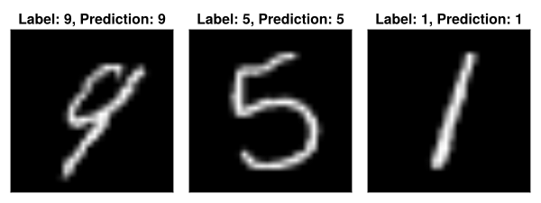

# Image Classification with LBDN

*Full example code can be found [here](https://github.com/acfr/RobustNeuralNetworks.jl/blob/main/examples/src/lbdn_mnist.jl).*

Our next example features an LBDN trained to classify the [MNIST](https://en.wikipedia.org/wiki/MNIST_database) dataset. We showed in [Wang & Manchester (2023)](https://proceedings.mlr.press/v202/wang23v.html) that training image classifiers with LBDNs makes them robust to adversarial attacks thanks to the built-in Lipschitz bound. In this example, we will demonstrate how to train an LBDN model on the MNIST dataset with the following steps:
1. Load the training and test data
2. Define a Lipschitz-bounded model
3. Define a loss function
4. Train the model to minimise the loss function
5. Evaluate the trained model
6. Investigate robustness

For details on how Lipschitz bounds increase classification robustness and reliability, please see the [paper](https://proceedings.mlr.press/v202/wang23v.html).

## 1. Load the data

Let's start by loading the training and test data. [`MLDatasets.jl`](https://juliaml.github.io/MLDatasets.jl/stable/) contains a number of common machine-learning datasets, including the [MNIST dataset](https://juliaml.github.io/MLDatasets.jl/stable/datasets/vision/#MLDatasets.MNIST). The following code loads the full dataset of 60,000 training images and 10,000 test images.

!!! info "Working on the GPU"
    Since we're dealing with images, we will load are data and models onto the GPU to speed up training. We'll be using [`CUDA.jl`](https://github.com/JuliaGPU/CUDA.jl). 
    
    If you don't have a GPU on your machine, just switch to `dev = cpu`. If you have a GPU but not an NVIDIA GPU, switch out `CUDA.jl` with whichever GPU backend supports your device. For more information on training models on a GPU, see [here](https://fluxml.ai/Flux.jl/stable/gpu/).

```julia
using CUDA
using MLDatasets: MNIST

# Choose device
dev = gpu
# dev = cpu

# Get MNIST training and test data
T = Float32
x_train, y_train = MNIST(T, split=:train)[:] |> dev
x_test,  y_test  = MNIST(T, split=:test)[:] |> dev
```

The feature matrices `x_train` and `x_test` are three-dimensional arrays where each 28x28 layer contains pixel data for a single handwritten number from 0 to 9 (see below for an example). The labels `y_train` and `y_test` are vectors containing the classification of each image as a number from 0 to 9. We can convert each of these to an input/output format better suited to training with [`Flux.jl`](https://fluxml.ai/).

```julia
using Flux
using Flux: OneHotMatrix

# Reshape features for model input
x_train = Flux.flatten(x_train)
x_test  = Flux.flatten(x_test)

# Encode categorical outputs and store training data
y_train = Flux.onehotbatch(y_train, 0:9)
y_test  = Flux.onehotbatch(y_test,  0:9)
train_data = [(x_train, y_train)]
```

Features are now stored in a 28xN `Matrix` where each column contains pixel data from a single image, and the labels have been converted to a 10xN `OneHotMatrix` where each column contains a 1 in the row corresponding to the image's classification (eg: row 3 for an image showing the number 2) and a 0 otherwise.


## 2. Define a model

We can now construct an LBDN model to train on the MNIST dataset. The larger the model, the better the classification accuracy will be, at the cost of longer training times. The smaller the Lipschitz bound ``\gamma``, the more robust the model will be to input perturbations (such as noise in the image). If ``\gamma`` is too small, however, it can restrict the model flexibility and limit the achievable performance. For this example, we use a small network of two 64-neuron hidden layers and set a Lipschitz bound of ``\gamma=5.0`` just to demonstrate the method.

```julia
using Random
using RobustNeuralNetworks

# Random seed for consistency
rng = MersenneTwister(42)

# Model specification
nu = 28*28              # Number of inputs (size of image)
ny = 10                 # Number of outputs (possible classifications)
nh = fill(64,2)         # 2 hidden layers, each with 64 neurons
γ  = 5.0f0              # Lipschitz bound of 5.0

# Set up model: define parameters, then create model
model_ps = DenseLBDNParams{T}(nu, nh, ny, γ; rng)
model = Chain(DiffLBDN(model_ps), Flux.softmax) |> dev
```

The `model` consisnts of two parts. The first is a callable [`DiffLBDN`](@ref) model constructed from its direct parameterisation, which is defined by an instance of [`DenseLBDNParams`](@ref) (see the [Package Overview](@ref) for more detail). The output is then converted to a probability distribution using a [`softmax`](https://fluxml.ai/Flux.jl/stable/models/nnlib/#NNlib.softmax) layer. Note that all [`AbstractLBDN`](@ref) models can be combined with traditional neural network layers using [`Flux.Chain`](https://fluxml.ai/Flux.jl/stable/models/layers/#Flux.Chain). We could also have used [`SandwichFC`](@ref) layers to build the network, as outlined in [Fitting a Curve with LBDN](@ref). The final model is loaded onto whichever device `dev` you chose in [1. Load the data](@ref).


## 3. Define a loss function

A typical loss function for training on datasets with discrete labels is the cross entropy loss. We can use the [`crossentropy`](https://fluxml.ai/Flux.jl/stable/models/losses/#Flux.Losses.crossentropy) loss function shipped with `Flux.jl`.

```julia
# Loss function
loss(model,x,y) = Flux.crossentropy(model(x), y)
```


## 4. Train the model

Before training the model to minimise the cross entropy loss, we can set up a callback function to evaluate the model performance during training.

```julia
using Statistics

# Check test accuracy during training
compare(y::OneHotMatrix, ŷ) = maximum(ŷ, dims=1) .== maximum(y.*ŷ, dims=1)
accuracy(model, x, y::OneHotMatrix) = mean(compare(y, model(x)))

# Callback function to show results while training
function progress(model, iter)
    train_loss = round(loss(model, x_train, y_train), digits=4)
    test_acc = round(accuracy(model, x_test, y_test), digits=4)
    @show iter train_loss test_acc
    println()
end
```

Let's train the model over 600 epochs using two learning rates: `1e-3` for the first 300, and `1e-4` for the last 300. We'll use the [`Adam`](https://fluxml.ai/Flux.jl/stable/training/optimisers/#Flux.Optimise.Adam) optimiser and the default [`Flux.train!`](https://fluxml.ai/Flux.jl/stable/training/reference/#Flux.Optimise.train!-NTuple{4,%20Any}) method. Once the model has been trained, we can save it for later with the [`BSON`](https://github.com/JuliaIO/BSON.jl) package. Note that `Flux.train!` updates the learnable parameters each time the model is evaluated on a batch of data, hence our choice of [`DiffLBDN`](@ref) over [`LBDN`](@ref) as a model wrapper.

```julia
using BSON

# Train with the Adam optimiser, and display progress every 50 steps
function train_mnist!(model, data; num_epochs=300, lrs=[1e-3,1e-4])
    opt_state = Flux.setup(Adam(lrs[1]), model)
    for k in eachindex(lrs)    
        for i in 1:num_epochs
            Flux.train!(loss, model, data, opt_state)
            (i % 50 == 0) && progress(model, i)
        end
        (k < length(lrs)) && Flux.adjust!(opt_state, lrs[k+1])
    end
end

# Train and save the model for later
train_mnist!(model, train_data)
bson("lbdn_mnist.bson", Dict("model" => model |> cpu))
```

Note that we move the model back to the `cpu` before saving it!

## 5. Evaluate the trained model

Our final model has a test accuracy of about 97% the full 10,000-image test set. We could improve this further by (for example) using a larger model, training the model for longer, fine-tuning the learning rate, or switching to the convolutional LBDN from [Wang & Manchester (2023)](https://proceedings.mlr.press/v202/wang23v.html) (yet to be implemented in this package).

```julia
# Print final results
train_acc = accuracy(model, x_train, y_train)*100
test_acc  = accuracy(model, x_test,  y_test)*100
println("Training accuracy: $(round(train_acc,digits=2))%")
println("Test accuracy:     $(round(test_acc,digits=2))%")
```
```@example mnist
println("Training accuracy:"," 98.15%") #hide
println("Test accuracy:","     97.24%") #hide
```

Let's have a look at some examples too.
```julia
using CairoMakie

# Make a couple of example plots
indx = rand(rng, 1:100, 3)
fig = Figure(resolution = (800, 300))
for i in eachindex(indx)

    # Get data and do prediction
    x = x_test[:,indx[i]]
    y = y_test[:,indx[i]]
    ŷ = model(x)

    # Make sure data is on CPU for plotting
    x = x |> cpu
    y = y |> cpu
    ŷ = ŷ |> cpu

    # Reshape data for plotting
    xmat = reshape(x, 28, 28)
    yval = (0:9)[y][1]
    ŷval = (0:9)[ŷ .== maximum(ŷ)][1]

    # Plot results
    ax, _ = image(fig[1,i], xmat, axis=(
            yreversed = true, 
            aspect = DataAspect(), 
            title = "True class: $(yval), Prediction: $(ŷval)"))

    # Format the plot
    ax.xticksvisible = false
    ax.yticksvisible = false
    ax.xticklabelsvisible = false
    ax.yticklabelsvisible = false
end
save("lbdn_mnist.svg", fig)
```



## 6. Investigate robustness

The main advantage of using an LBDN for image classification is its built-in robustness to noise (or attacks) added to the image data. This robustness is a direct benefit of the Lipschitz bound. As explained in the [Package Overview](@ref), the Lipschitz bound effectively defines how "smooth" the network is: the smaller the Lipschitz bound, the less the network outputs will change as the inputs vary. For example, small amounts of noise added to the image will be less likely to change its classification. A detailed investigation into this effect is presented in [Wang & Manchester (2023)](https://proceedings.mlr.press/v202/wang23v.html).

We can see this effect first-hand by comparing the LBDN to a standard MLP built from `Flux.Dense` layers. Let's first create a `dense` network with the same layer structure as the LBDN, and train it with the same `train_mnist!()` function from earlier.
```julia
# Create a Dense network
init = Flux.glorot_normal(rng)
initb(n) = Flux.glorot_normal(rng, n)
dense = Chain(
    Dense(nu, nh[1], Flux.relu; init, bias=initb(nh[1])),
    Dense(nh[1], nh[2], Flux.relu; init, bias=initb(nh[2])),
    Dense(nh[2], ny; init, bias=initb(ny)),
    Flux.softmax
) |> dev

# Train it and save for later
train_mnist!(dense, train_data)
bson("dense_mnist.bson", Dict("model" => dense |> cpu))
```

The trained model performs similarly to the LBDN on the original test dataset.
```julia
# Print final results
train_acc = accuracy(dense, x_train, y_train)*100
test_acc  = accuracy(dense, x_test,  y_test)*100
println("Training accuracy: $(round(train_acc,digits=2))%")
println("Test accuracy:     $(round(test_acc,digits=2))%")
```
```@example mnist
println("Training accuracy:"," 97.65%") #hide
println("Test accuracy:","     96.61%") #hide
```

As a simple test of robustness, we'll add uniformly-sampled random noise in the range ``[-\epsilon, \epsilon]`` to the pixel data in the test dataset for a range of noise magnitudes ``\epsilon \in [0, 200/255].`` We can record the test accuracy for each perturbation size and store it for plotting.
```julia
# Get test accuracy as we add noise
uniform(x) = 2*rand(rng, T, size(x)...) .- 1 |> dev
function noisy_test_error(model, ϵ=0)
    noisy_xtest = x_test .+ ϵ*uniform(x_test)
    accuracy(model, noisy_xtest,  y_test)*100
end

ϵs = T.(LinRange(0, 200, 10)) ./ 255
lbdn_error = noisy_test_error.((model,), ϵs)
dense_error = noisy_test_error.((dense,), ϵs)

# Plot results
fig = Figure(resolution=(500,300))
ax1 = Axis(fig[1,1], xlabel="Perturbation size", ylabel="Test accuracy (%)")
lines!(ax1, ϵs, lbdn_error, label="LBDN (γ=5)")
lines!(ax1, ϵs, dense_error, label="Dense")

xlims!(ax1, 0, 0.8)
axislegend(ax1, position=:lb)
save("lbdn_mnist_robust.svg", fig)
```


Plotting the results very clearly shows that the `dense` network, which has no guarantees on its Lipschitz bound, quickly loses its accuracy as small amounts of noise are added to the image. In contrast, the LBDN `model` maintains its accuracy even when the (maximum) perturbation size is as much as 80% of the maximum pixel values. This is an illustration of why image classification is one of the most promising use-cases for LBDN models. For a more detailed comparison of LBDN with state-of-the-art image classification methods, see [Wang & Manchester (2023)](https://proceedings.mlr.press/v202/wang23v.html).