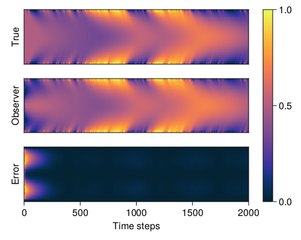

# PDE Observer Design with REN
*This example was first presented in Section VIII of [Revay, Wang & Manchester (2021)](https://doi.org/10.48550/arXiv.2104.05942).*

In this example, we'll show how RENs can be used to learn stable observers of nonlinear systems. State estimation (observer design) is an important problem in many practical applications. It is often difficult to design a stable observer model for a nonlinear system. A common approach is the *Extended Kalman Filter* ([EKF](https://en.wikipedia.org/wiki/Extended_Kalman_filter)). In our case, we'll pose the problem as a supervised learning problem using a contracting REN. For a detailed explanation of the theory behind this example, please refer to Section VIII of the original [paper](https://doi.org/10.48550/arXiv.2104.05942).

## 1. Problem statement

### Observer design

We'll start with some background on the observer design. Consider a nonlinear system of the following form with state vector to be estimated ``x_t``, known control signal ``u_t``, unkown disturbances ``w_t``, and measured output ``y_t.``

```math
\begin{aligned}
x_{t+1} &= f_m(x_t, u_t, w_t) \\
y_t &= g_m(x_t, u_t, w_t)
\end{aligned}
```

An observer is a dynamical system whose purpose is to estimate the true state of the original system. A standard [Luenberger observer](https://en.wikipedia.org/wiki/State_observer) strucure is a combination of a function ``f_m(\cdot)`` to predict the dynamics of the system and a measurement correction function ``l(\cdot),`` where ``\hat{x}`` is the state of the observer itself, and also the estimated state of the original system.

```math
\hat{x}_{t+1} = f_m(\hat{x}_{t}, u_t, 0)+l(\hat{x}_{t}, u_t, y_t)
```

A more general structure for an observer is any system of the form

```math
\hat{x}_{t+1} = f_o(\hat{x}_{t}, u_t, y_t).
```
If we want the state estimate to converge to the true system state, we need two properties: the observer must be contracting (see the [Package Overview](@ref) for a overview of contracting systems) and the following condition must hold:

```math
f_m(x, u, 0)=f_o(x, u, g_m(x, u, 0))
```
That is, when ``w=0`` we have ``\hat{x}_t \rightarrow x_t`` as time progresses. This implies that if ``\hat{x}_0 = x_0`` then ``\hat{x}_t=x_t`` for all ``t>0``, which means the true state is a particular solution of the observer. The contraction implies all solutions of the observer converge to the true state. For more details, please refer to Section VIII and Appendix E of the [paper](https://doi.org/10.48550/arXiv.2104.05942).

### Reaction-diffusion PDE

We consider designing an observer for the following semi-linear reaction-diffusion partial differential equation.

```math
\begin{aligned}
\frac{\partial \xi(z,t)}{\partial t} &= \frac{\partial^2 \xi(z,t)}{\partial z^2}+R(\xi,z,t)\\
\xi (z,0)&=1\\
\xi(1,t)&=\xi(0,t)=b(t)\\
y&=g(\xi,z,t)\\
R(\xi, z, t)&=\frac{1}{2}\xi(1-\xi)(\xi-\frac{1}{2})
\end{aligned}
```
where the state ``\xi(z,t)`` is a function of both spatial coordinate ``z \in [0,1]`` and time. The boundary condition is considered to be a known input and we assume there is a single measurement taken from the center of the spatial domain: ``y(t)=\xi(0.5,t).`` We discretize ``z`` into ``N`` intervals with ``z^i=i\Delta z.`` Then the state of spatial coordinate is described by ``\xi^i_t=\xi(z^i,t).`` The dynamics over a time period ``\Delta t`` can be approximated using the finite difference ``\frac{\partial \xi(z,t)}{\partial t} \approx \frac{\xi^i_{t+\Delta t}-\xi ^i_t}{\Delta t}.`` Substituting these into the reaction-diffusion PDEs, we can develop the state-space form:

```math
\bar{\xi}_{t+\Delta t}=a_{RD}(\bar{\xi}_t,b_t), \quad y_t=c_{RD}(\bar{\xi}_t)
```

```julia
using LinearAlgebra
using Statistics

dtype = Float64
# Problem setup
nx = 51             # Number of states
n_in = 1            # Number of inputs
L = 10.0            # Size of spatial domain
sigma = 0.1         # Used to construct time step

# Discretise space and time
dx = L / (nx - 1)
dt = sigma * dx^2

# State dynamics and output functions f, g
function f(u0, d)
    u, un = copy(u0), copy(u0)
    for _ in 1:5
        u = copy(un) 

        # FD approximation of heat equation
        f_local(v) = v[2:end - 1, :] .* (1 .- v[2:end - 1, :]) .* ( v[2:end - 1, :] .- 0.5)
        laplacian(v) = (v[1:end - 2, :] + v[3:end, :] - 2v[2:end - 1, :]) / dx^2
        
        # Euler step for time
        un[2:end - 1, :] = u[2:end - 1, :] + dt * (laplacian(u) + f_local(u) / 2 )

        # Boundary condition
        un[1:1, :] = d;
        un[end:end, :] = d;
    end
    return u
end

g(u, d) = [d; u[end ÷ 2:end ÷ 2, :]]

```
## 2. Generate training data
We will generate training data for `` t=0,\cdots,10^5\Delta t`` by simulating the system with ``N=50`` intervals and ``10^5`` time steps with the stochastic input ``b_{t+1}=b_t+0.05w_t`` where ``w_t\sim \mathcal{N}[0,1]``

```julia
using Random

# Generate simulated data
function get_data(npoints=1000; init=zeros)

    X = init(dtype, nx, npoints)
    U = init(dtype, n_in, npoints)

    for t in 1:npoints-1

        # Next state
        X[:, t+1] = f(X[:, t], U[:, t])
        
        # Next input bₜ
        u_next = U[t] + 0.05f0*randn(dtype)
        (u_next > 1) && (u_next = 1)
        (u_next < 0) && (u_next = 0)
        U[t + 1] = u_next
    end
    return X, U
end

X, U = get_data(100000; init=zeros)
xt = X[:, 1:end - 1]
xn = X[:, 2:end]
y = g(X, U)

# Store for the observer (inputs are inputs to observer)
input_data = [U; y][:, 1:end - 1]
batches = 200
data = Flux.Data.DataLoader((xn, xt, input_data), batchsize=batches, shuffle=true)
```

## 3. Define a contracting REN

Now we can define a contracting REN to parameterize the observer mentioned above. We'll use a contracting REN with ``q=500`` neurons, and output mapping as ``[C_2,D_{21},D_{22}]=[I,0,0].`` [`DiffREN`](@ref) constructs a differentialble REN from its direct parametrization, i.e. [`ContractingRENParams`](@ref) (see the [Package Overview](@ref) for more detail) and updates the parameter every time the model is called.

```julia
using RobustNeuralNetworks

# Constuct a REN
nv = 500
nu = size(input_data, 1)
ny = nx
model_params = ContractingRENParams{dtype}(
    nu, nx, nv, ny; 
    nl = tanh, ϵ=0.01,
    polar_param = false, 
    is_output = false # Define the output mapping
)
model = DiffREN(model_params)
```

## 4. Train the model

Now we can train the observer to give the prediction of system states. First, we need to define the loss function ``\mathcal{L}(\tilde z) = \frac{1}{T} \sum^{T-1}_{t=0}|a_{RD}(\tilde{\xi}_t,\tilde{b}_t)-f_o(\tilde{\xi}_t,\tilde{b}_t,\tilde{y}_t)|^2,`` where ``\tilde{z} = (\tilde{\xi}_t,\tilde{y}_t,\tilde{b}_t)`` is defined as the the training data generated from previous section. This cost funtion calculates the one step ahead prediction error.

```julia
using BSON
using Flux
using Formatting

# Define a loss function
function loss(model, xn, x, u)
    xpred = model(x, u)[1]
    return mean(norm(xpred[:, i] - xn[:, i]).^2 for i in 1:size(x, 2))
end
```
We use SGD with the [`Adam`](https://fluxml.ai/Flux.jl/stable/training/optimisers/#Flux.Optimise.Adam) optimizer to train te REN. We use [`Flux.withgradient`](https://fluxml.ai/Flux.jl/stable/training/zygote/#Zygote.withgradient-Tuple{Any,%20Vararg{Any}}) to calucate the gradient and the value of the loss function, then use [`Flux.update!`](https://fluxml.ai/Flux.jl/stable/training/reference/#Optimisers.update!) to update the trainable parameters of the REN. We start from a learning rate of ``10^{-3}`` and decrease it by powers of ``10`` once when the loss function does not decrease. The training loop will stop when it reaches the minimal learning rate ``10^{-7}`` or when we have reached ``50`` training epochs. Once the model has been trained, we can save it for later with the [`BSON`](https://github.com/JuliaIO/BSON.jl) package.

```julia
# Train the model
function train_observer!(model, data; Epochs=50, lr=1e-3, min_lr=1e-7)

    # Set up the optimiser
    opt_state = Flux.setup(Adam(lr), model)

    mean_loss, loss_std = [1e5], []
    for epoch in 1:Epochs
        batch_loss = []
        for (xni, xi, ui) in data

            # Get gradient and store loss
            train_loss, ∇J = Flux.withgradient(loss, model, xni, xi, ui)
            Flux.update!(opt_state, model, ∇J[1])
        
            # Store losses for later
            push!(batch_loss, train_loss)
            printfmt("Epoch: {1:2d}\tTraining loss: {2:1.4E} \t lr={3:1.1E}\n", epoch, train_loss, lr)
        end

        # Print stats through epoch
        println("------------------------------------------------------------------------")
        printfmt("Epoch: {1:2d} \t mean loss: {2:1.4E}\t std: {3:1.4E}\n", epoch, mean(batch_loss), std(batch_loss))
        println("------------------------------------------------------------------------")
        push!(mean_loss, mean(batch_loss))
        push!(loss_std, std(batch_loss))

        # Check for decrease in loss
        if mean_loss[end] >= mean_loss[end - 1]
            println("Reducing Learning rate")
            lr *= 0.1
            Flux.adjust!(opt_state, lr)
            (lr <= min_lr) && (return mean_loss, loss_std)
        end
    end
    return mean_loss, loss_std
end

# Train and save the model
tloss, loss_std = train_observer!(model, data; Epochs=50, lr=1e-3, min_lr=1e-7)
bson("../results/pde_obsv.bson", 
    Dict(
        "model" => model, 
        "training_loss" => tloss, 
        "loss_std" => loss_std
    )
)
```

Running the training loop can take an hour or two, so here's one we prepared earlier.

```@example pde_bosv
using BSON
model = BSON.load("../../src/assets/ren-pde/pde_obsv.bson")["model"]
println(typeof(model))
```
## 5. Evaluate the model

Now we can evaluate the performance of the learned observer using REN. We'll first generate some test data by simulating the system for ``2000`` time steps, and calculate the prediction using the observer.
```julia
# Test observer
T = 2000
init = (args...) -> 0.5*ones(args...)
x, u = get_data(T, init=init)
y = [g(x[:, t:t], u[t]) for t in 1:T]

batches = 1
observer_inputs = [repeat([ui; yi], outer=(1, batches)) for (ui, yi) in zip(u, y)]

# Simulate the model through time
function simulate(model::AbstractREN, x0, u)
    recurrent = Flux.Recur(model, x0)
    output = recurrent.(u)
    return output
end
x0 = init_states(model, batches)
xhat = simulate(model, x0, observer_inputs)
Xhat = reduce(hcat, xhat)
```
Now we can plot the result of the ground truth and the prediction, as well as the error between the generated data and observer.
```julia
using CairoMakie

# Make a plot to show PDE and errors
function plot_heatmap(f1, xdata, i)

    # Make and label the plot
    xlabel = i < 3 ? "" : "Time steps"
    ylabel = i == 1 ? "True" : (i == 2 ? "Observer" : "Error")
    ax, _ = heatmap(f1[i,1], xdata', colormap=:thermal, axis=(xlabel=xlabel, ylabel=ylabel))

    # Format the axes
    ax.yticksvisible = false
    ax.yticklabelsvisible = false
    if i < 3
        ax.xticksvisible = false
        ax.xticklabelsvisible = false
    end
    xlims!(ax, 0, T)
end

f1 = Figure(resolution=(500,400))
plot_heatmap(f1, x, 1)
plot_heatmap(f1, Xhat[:, 1:batches:end], 2)
plot_heatmap(f1, abs.(x - Xhat[:, 1:batches:end]), 3)
Colorbar(f1[:,2], colorrange=(0,1),colormap=:thermal)

display(f1)
```
In the plot, the x-axis is the time dimension and the y-axis is the spatial dimension.

