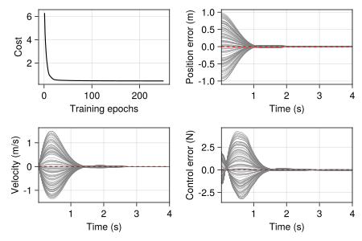

# Reinforcement Learning with LBDN

*Full example code can be found [here](https://github.com/acfr/RobustNeuralNetworks.jl/blob/main/examples/src/lbdn_rl.jl).*

One of the original motivations for developing `RobustNeuralNetworks.jl` was to guarantee stability and robustness in learning-based control. Some of our recent research (eg: [Wang et al. (2022)](https://ieeexplore.ieee.org/abstract/document/9802667) and [Barbara, Wang & Manchester (2023)](https://doi.org/10.48550/arXiv.2304.06193)) has shown that, with the right controller architecture, we can learn over the space of all stabilising controllers for linear/nonlinear systems using standard reinforcement learning techniques, so long as our control policy is parameterised by a REN (see also [(Convex) Nonlinear Control with REN](@ref)).

In this example, we'll demonstrate how to train an LBDN controller with *Reinforcement Learning* (RL) for a simple nonlinear dynamical system. This controller will not have any stability guarantees. The purpose of this example is simply to showcase the steps required to set up RL experiments for more complex systems with RENs and LBDNs.

## 1. Overview

Let's consider the simple mechanical system shown below: a box of mass ``m`` sits in a tub of fluid, held between the walls of the tub by two springs, each with spring constant ``k/2.`` We can push the box with force ``u.`` Its dynamics are
```math
m\ddot{q} = u - kq - \mu \dot{q} |\dot{q}|
```
where ``\mu`` is the viscous friction coefficient due to the box moving through the fluid.

```@example
@html_str """<p align="center"> <object type="image/png" data=$(joinpath(Main.buildpath, "../assets/lbdn-rl/mass_rl.png")) width="35%"></object> </p>""" #hide
```

We can write this as a (nonlinear) state-space model with state ``x = (q,\dot{q})^\top,`` control input ``u,`` and dynamics
```math
\dot{x} = f(x,u) = \begin{bmatrix}
\dot{q} \\ (u - kq - \mu \dot{q} |\dot{q}|)/m
\end{bmatrix}.
```
This is a continous-time model of the dynamics. For our purposes, we'll need a discrete-time model. We can discretise the dynamics using a [forward Euler approximation](https://en.wikipedia.org/wiki/Euler_method) such that
```math
x_{t+1} = x_t + \Delta t \cdot f(x_t, u_t)
```
where ``\Delta t`` is the time-step. This approximation typically requires a very small time-step for numerical stability, but will be fine for our simple example. A more robust method is to use a fourth (or higher) order [Runge-Kutta scheme](https://en.wikipedia.org/wiki/Runge%E2%80%93Kutta_methods).

Our aim is to learn a controller ``u = \mathcal{K}_\theta(x, q_\mathrm{ref}),`` defined by some learnable parameters ``\theta,`` that can push the box to any goal position ``q_\mathrm{ref}`` that we choose. Specifically, we want the box to:
- Reach a (stationary) goal position ``q_\mathrm{ref}``
- Within a time period ``T``

Note that the force required to keep the box an equilibrium position ``q_\mathrm{ref}`` is simply ``u_\mathrm{ref} = k q_\mathrm{ref}`` (set the derivative terms in the dynamics to zero and re-arrange for ``u``). We can encode these objectives into a cost function ``J_\theta`` and write our RL problem as
```math
\min_\theta \mathbb{E} \left[ J_\theta \right]
\quad \text{where} \quad
J_\theta = \sum_{t=0}^{T-1} c_1 (q_t - q_\mathrm{ref})^2 + c_2 \dot{q}_t^2 + c_3 (u_t - u_\mathrm{ref})^2
```
where ``c_1, c_2, c_3`` are cost weightings, and the expectation is over different initial and goal positions of the box.


## 2. Problem setup

Let's define some parameters for our system and translate the dynamics into Julia code. We'll consider a box of mass ``m=1``, a spring constant of ``k=5,`` and a viscous damping coefficient ``\mu = 0.5``. We'll simulate the system over ``T = 4``s time horizons with a time-step of ``\Delta t = 0.02``s.

```julia
m = 1                   # Mass (kg)
k = 5                   # Spring constant (N/m)
μ = 0.5                 # Viscous damping coefficient (kg/m)

Tmax = 4                # Simulation horizon (s)
dt = 0.02               # Time step (s)
ts = 1:Int(Tmax/dt)     # Array of time indices
```

Now we can generate some training data. Suppose the box always starts at rest from the zero position, and the goal position could be anywhere in the range ``q_\mathrm{ref} \in [-1,1]``. Our training data consists of a batch of 80 initial conditions (all zeros) and 80 randomly-sampled goal positions.
```julia
using Random
rng = MersenneTwister(42)

nx, nref, batches = 2, 1, 80
x0 = zeros(nx, batches)
qref = 2*rand(rng, nref, batches) .- 1
uref = k*qref
```

It's good practice (and faster) to simulate all of these simulation batches at once, so we define our dynamics functions to operate on matrices of states and controls. Each row is a different state or control, and each column corresponds to a simulation for a particular goal position.
```julia
_visc(v::Matrix) = μ * v .* abs.(v)
f(x::Matrix,u::Matrix) = [x[2:2,:]; (u[1:1,:] - k*x[1:1,:] - _visc(x[2:2,:]))/m]
fd(x::Matrix,u::Matrix) = x + dt*f(x,u)
```

Reinforcement learning problems generally involve simulating the system over some time horizon and collecting a series of rewards or costs at each time step. Control policies are then trained using approximations of the cost gradient ``\nabla J_\theta`` because it is often difficult (or impossible) to compute the exact gradient. [ReinforcementLearning.jl](https://juliareinforcementlearning.org/) is the home of all things RL in Julia.

For this simple example, we can just write a differentiable simulator of the dynamics. The simulator takes a batch of initial states, goal positions, and a controller `model` whose inputs are ``[x; q_\mathrm{ref}]``. It computes a batch of trajectories of states and controls ``z = \{[x_0;u_0], \ldots, [x_{T-1};u_{T-1}]\}`` for later use. To get around the well-known issue of [array mutation with auto-differentiation](https://fluxml.ai/Zygote.jl/stable/limitations/), we use a [Zygote.Buffer](https://fluxml.ai/Zygote.jl/stable/utils/#Zygote.Buffer) to iteratively store the outputs.

```julia
using Zygote: Buffer

function rollout(model, x0, qref)
    z = Buffer([zero([x0;qref])], length(ts))
    x = x0
    for t in ts
        u = model([x;qref])
        z[t] = vcat(x,u)
        x = fd(x,u)
    end
    return copy(z)
end
```

Once we have our trajectories, we just need a function to evaluate the cost given some weightings ``c_1,c_2,c_3``.
```julia
using Statistics

weights = [10,1,0.1]
function _cost(z, qref, uref)
    Δz = z .- [qref; zero(qref); uref]
    return mean(sum(weights .* Δz.^2; dims=1))
end
cost(z::AbstractVector, qref, uref) = mean(_cost.(z, (qref,), (uref,)))
```

## 3. Define a model

For this example, we'll learn an LBDN controller with a Lipschitz bound of ``\gamma = 20``. Its inputs are the state ``x_t`` and goal position ``q_\mathrm{ref}``, while its outputs are the control force ``u_t``. We have chosen a model with two hidden layers each of 32 neurons just as an example. For details on how Lipschitz bounds can be useful in learning robust controllers, please see [Barbara, Wang & Manchester (2023)](https://doi.org/10.48550/arXiv.2304.06193).

```julia
using Flux
using RobustNeuralNetworks

nu = nx + nref          # Inputs (states and reference)
ny = 1                  # Outputs (control action u)
nh = fill(32, 2)        # Hidden layers
γ = 20                  # Lipschitz bound
model_ps = DenseLBDNParams{Float64}(nu, nh, ny, γ; nl=relu, rng)
```

## 4. Define a loss function

This is where things get interesting. The `model_ps` above contain all the information required to define a dense LBDN model. However, `model_ps` is not a model that can be evaluated on data: it is a *model parameterisation*, and contains the learnable parameters ``\theta``. If we want to evaluate an LBDN on data, we first need to construct the model using the [`LBDN`](@ref) wrapper. This converts the model parameterisation to an "explicit" form for evaluation, as described in detail in the [Package Overview](@ref). Our loss function therefore looks like this.

```julia
function loss(model_ps, x0, qref, uref)
    model = LBDN(model_ps)
    z = rollout(model, x0, qref)
    return cost(z, qref, uref)
end
```

!!! info "Include model construction in the loss function"
    We need to include this mapping in the loss function, because it describes how the learnable parameters ``\theta`` in `model_ps` affect the data. If we don't include it, then `loss()` does not depend on the model parameters, and their gradients will be zero!

    See [Can't I just use `DiffLBDN`?](@ref) below for more details.


## 5. Train the model

Now that we have set up the RL problem, all that remains is to train the controller model. We've written a function that trains the controller and keeps track of the loss (cost ``J_\theta``) for each simulation in our batch of 80. Note that we pass in the `model_ps`, which are converted to a `model` inside the `loss()` function during training.

```julia
using Printf

function train_box_ctrl!(model_ps, loss_func; lr=1e-3, epochs=250, verbose=false)
    costs = Vector{Float64}()
    opt_state = Flux.setup(Adam(lr), model_ps)
    for k in 1:epochs

        train_loss, ∇J = Flux.withgradient(loss_func, model_ps, x0, qref, uref)
        Flux.update!(opt_state, model_ps, ∇J[1])

        push!(costs, train_loss)
        verbose && @printf "Iter %d loss: %.2f\n" k train_loss
    end
    return costs
end

costs = train_box_ctrl!(model_ps, loss; verbose=true)
```

## 6. Evaluate the trained model

Once we've trained the model to move the box, we should check that it actually works. In the code below, we generate 100 batches of test data. In each one, the box starts at the origin at rest, and is moved through the fluid to a different (random) goal position ``q_\mathrm{ref} \in [-1,1].`` We plot the states and controls alongside the loss curve from training.

```julia
using CairoMakie

lbdn = LBDN(model_ps)
x0_test = zeros(2,100)
qr_test = 2*rand(rng, 1, 100) .- 1
z_lbdn = rollout(lbdn, x0_test, qr_test)

# Plot position, velocity, and control input over time
function plot_box_learning(costs, z, qr)

    _get_vec(x, i) = reduce(vcat, [xt[i:i,:] for xt in x])
    q = _get_vec(z, 1)
    v = _get_vec(z, 2)
    u = _get_vec(z, 3)
    t = dt*ts
    
    Δq = q .- qr .* ones(length(z), length(qr_test))
    Δu = u .- k*qr .* ones(length(z), length(qr_test))

    f1 = Figure(resolution = (600, 400))
    ga = f1[1,1] = GridLayout()

    ax0 = Axis(ga[1,1], xlabel="Training epochs", ylabel="Cost")
    ax1 = Axis(ga[1,2], xlabel="Time (s))", ylabel="Position error (m)", )
    ax2 = Axis(ga[2,1], xlabel="Time (s))", ylabel="Velocity (m/s)")
    ax3 = Axis(ga[2,2], xlabel="Time (s)", ylabel="Control error (N)")

    lines!(ax0, costs, color=:black)
    for k in axes(q,2)
        lines!(ax1, t, Δq[:,k], linewidth=0.5,  color=:grey)
        lines!(ax2, t,  v[:,k], linewidth=0.5,  color=:grey)
        lines!(ax3, t, Δu[:,k], linewidth=0.5,  color=:grey)
    end

    lines!(ax1, t, zeros(size(t)), color=:red, linestyle=:dash)
    lines!(ax2, t, zeros(size(t)), color=:red, linestyle=:dash)
    lines!(ax3, t, zeros(size(t)), color=:red, linestyle=:dash)
    
    xlims!.((ax1,ax2,ax3), (t[1],), (t[end],))
    display(f1)
    return f1
end

fig = plot_box_learning(costs, z_lbdn, qr_test)
```


The box clearly moves to the required position within the time frame and stays there in all cases, showing that the control is up to the task.


## Can't I just use `DiffLBDN`?

Readers who have worked through the [Fitting a Curve with LBDN](@ref) and [Image Classification with LBDN](@ref) examples will know that we have included the [`DiffLBDN`](@ref) and [`DiffREN`](@ref) wrappers to make training models more like `Flux.jl`. These wrappers convert a model parameterisation to an explicit model each time they are called. This means the user does **not** have to re-construct the model in the loss function, and can simply use the following.
```julia
loss2(model, x0, qref, uref) = cost(rollout(model, x0, qref), qref, uref)
```

The catch is computation speed, particular in an RL context. Careful inspection of the `rollout()` function shows that the `model` is evaluated many times within the loss function before the learnable parameters are updated with `Flux.update!()`. As discussed in the [Package Overview](@ref), the major computational bottleneck for RENs and LBDNs is the conversion from learnable (direct) parameters to an explicit model. Constructing the model only when the parameters are updated therefore saves considerably on computation time, particularly for large models.

For example, let's train single-hidden-layer LBDNs with ``n`` neurons over 100 training epochs on this RL problem,  and log the time taken to train a model when using [`LBDN`](@ref) and [`DiffLBDN`](@ref).
```julia
function lbdn_compute_times(n; epochs=100)

    lbdn_ps = DenseLBDNParams{Float64}(nu, [n], ny, γ; nl=relu, rng)
    diff_lbdn = DiffLBDN(deepcopy(lbdn_ps))

    t_lbdn = @elapsed train_box_ctrl!(lbdn_ps, loss; epochs)            # Build LBDN in loss
    t_diff_lbdn = @elapsed train_box_ctrl!(diff_lbdn, loss2; epochs)    # Use DiffLBDN
    return [t_lbdn, t_diff_lbdn]

end
```

Let's run this function over hidden layers of size ``n = 2, 2^2, \ldots, 2^9`` and plot the results.
```julia
# Evaluate computation time with different hidden-layer sizes
# Run it once first for just-in-time compiler
sizes = 2 .^ (1:9)
lbdn_compute_times(2; epochs=1)
comp_times = reduce(hcat, lbdn_compute_times.(sizes))

# Plot the results
f1 = Figure(resolution = (600, 400))
ax = Axis(
    f1[1,1], 
    xlabel="Hidden layer size", 
    ylabel="Training time (s) (100 epochs)", 
    xscale=Makie.log2, yscale=Makie.log10
)
lines!(ax, sizes, comp_times[1,:], label="LBDN")
lines!(ax, sizes, comp_times[2,:], label="DiffLBDN")

xlims!(ax, [sizes[1], sizes[end]])
axislegend(ax, position=:lt)
display(f1)
```


Even for a single-layer LBDN with ``2^9 = 512`` neurons, using [`DiffLBDN`](@ref) takes an order of magnitude longer to train than only constructing the [`LBDN`](@ref) model each time the `loss()` function is called. We offer the following advice.

!!! info "When to use LBDN vs. DiffLBDN"
    If many evaluations of the model are required before `Flux.update!()` (or equivalent) is called, use [`LBDN`](@ref) to define the model once, evaluate it many times, then construct it again once the learnable parameters change.

    If `Flux.update!()` is called after each model evaluation (eg: [Image Classification with LBDN](@ref)), it is often more convenient and equally fast to use [`DiffLBDN`](@ref).

    The same applies for [`REN`](@ref) and [`DiffREN`](@ref).