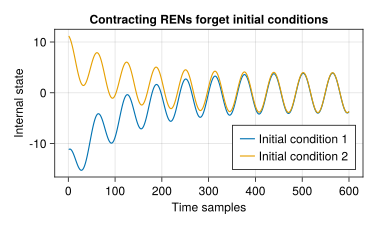

# Background Theory

The `RobustNeuralNetwork.jl` package contains two classes of neural network models: Recurrent Equilibrium Networks (RENs) and Lipschitz-Bounded Deep Networks (LBDNs). This page will give a brief overview of the model architectures and their parameterisations. 

For more detail on RENs and LBDNs, please see [Revay, Wang & Manchester (2021)](https://doi.org/10.48550/arXiv.2104.05942) and [Wang & Manchester (2023)](https://doi.org/10.48550/arXiv.2301.11526), respectively.


## What are RENs and LBDNs?

A *Recurrent Equilibrium Network* (REN) is a linear system in a feedback interconnection with a nonlinear activation function. Denote ``x_t \in \mathbb{R}^n`` as the internal states of the system, ``u_t \in\mathbb{R}^m`` as its inputs, and ``y_t \in \mathbb{R}^p`` as its outputs. Mathematically, a REN can be represented as

```math
\begin{aligned}
\begin{bmatrix}
x_{t+1} \\ v_t \\ y_t
\end{bmatrix}&=
\overset{W}{\overbrace{
		\left[
		\begin{array}{c|cc}
		A & B_1 & B_2 \\ \hline 
		C_{1} & D_{11} & D_{12} \\
		C_{2} & D_{21} & D_{22}
		\end{array} 
		\right]
}}
\begin{bmatrix}
x_t \\ w_t \\ u_t
\end{bmatrix}+
\overset{b}{\overbrace{
		\begin{bmatrix}
		b_x \\ b_v \\ b_y
		\end{bmatrix}
}}, \\
w_t=\sigma(&v_t):=\begin{bmatrix}
\sigma(v_{t}^1) & \sigma(v_{t}^2) & \cdots & \sigma(v_{t}^q)
\end{bmatrix}^\top, 
\end{aligned}
```

where ``v_t, w_t \in \mathbb{R}^q`` are the inputs and outputs of neurons passing through the activation function ``\sigma``. Graphically, this is equivalent to the following, where the linear (actually affine) system ``G`` represents the first of the two equations above.

```@raw html
<p align="center">
  
</p>
```

A *Lipschitz-Bounded Deep Network* (LBDN) can be thought of as a specialisation of a REN with a state dimension of ``n = 0``. That is, LBDN models have no dynamics or memory associated with them. In reality, we use this simplification to construct LBDN models completely differently to RENs. We construct LBDNs as ``L``-layer feed-forward networks, much like [MLPs](https://en.wikipedia.org/wiki/Multilayer_perceptron) or [CNNs](https://en.wikipedia.org/wiki/Convolutional_neural_network), described by the following recursive equations.

```math
\begin{aligned}
z_0 &= x \\
z_{k+1} &= \sigma(W_k z_k + b_k), \quad k = 0, \ldots, L-1 \\
y &= W_L z_L + b_L
\end{aligned}
```

See [Wang & Manchester (2023)](https://doi.org/10.48550/arXiv.2301.11526) for more details on LBDNs.


## Direct & explicit parameterisations

The key advantage of the RENs and LBDNs in `RobustNeuralNetworks.jl` is that the models naturally satisfy a set of user-defined robustness constraints (see [Definitions of robustness](@ref)). This means that we can guarantee the robustness of our neural networks *by construction*. There is no need to impose additional (possibly computationally-expensive) constraints while training a REN or LBDN. One can simply use unconstrained optimisation methods like gradient descent and be sure that the final model will satisfy the robustness requirements.

We achieve this by constructing the weight matrices and bias vectors in the RENs and LBDNs to satisfy linear matrix inequalities (see [Revay, Wang & Manchester (2021)](https://doi.org/10.48550/arXiv.2104.05942) for details). From a high level, think of the equations above as the **explicit parameterisation** of RENs and LBDNs. I.e: a callable model that we can evaluate on data. For a REN, the *explicit parameters* are ``\bar{\theta} = [W, b]``, and for an LBDN they are ``\bar{\theta} = [W_0, b_0, \ldots, W_L, b_L]``.

The learnable parameters of the model are a set of free variables ``\theta \in \mathbb{R}^N`` which are completely unconstrained. When the set of learnable parameters for a model is exactly ``\mathbb{R}^N``, we call this a **direct parameterisation**. The *direct parameters* of the model are then ``\theta.`` 

When training a REN or LBDN, we learn and update the direct parameters ``\theta`` and convert them to the explicit parameters ``\bar{\theta}`` only for model evaluation. The mapping ``\theta \mapsto \bar{\theta}`` ensures that the REN or LBDN being evaluated is constructed in such a way that the robustness criteria are met.

## Definitions of robustness

There are a number of different robustness criteria which our REN models can satisfy. Some relate to the internal dynamics of the model, others relate to the input/output map. LBDNs are less general. They are specifically constructed to satisfy Lipschitz bounds. See the section on [Lipschitz bounds (smoothness)](@ref) below.

### Contracting systems

First and foremost, all of our REN models are **contracting systems**. This means that they exponentially "forget" initial conditions. That is, if two copies of the system start at two different initial conditions but are given the same inputs, the internal states will converge over time. See below for an example of a contracting REN with a single internal state.

```@raw html
<p align="center">
  
</p>
```

### Integral quadratic constraints

We define robustness criteria on the input/output map of our RENs with *incremental integral quadratic constraints* (IQCs). Suppose we have a model ``\mathcal{M}`` starting at two different initial conditions ``a,b`` with two different input signals ``u, v``, and consider their corresponding output trajectories ``y^a = \mathcal{M}_a(u)`` and ``y^b = \mathcal{M}_b(v).`` The model ``\mathcal{M}`` satisfies the IQC defined by matrices ``(Q, S, R)`` if

```math
\sum_{t=0}^T
\begin{bmatrix}
y^a_t - y^b_t \\ u_t - v_t
\end{bmatrix}^\top
\begin{bmatrix}
Q & S^\top \\ S & R
\end{bmatrix}
\begin{bmatrix}
y^a_t - y^b_t \\ u_t - v_t
\end{bmatrix} 
\ge -d(a,b)
```

for some function ``d(a,b) \ge 0`` with ``d(a,a) = 0``, where ``0 \preceq Q \in \mathbb{R}^{p\times p}``, ``S\in\mathbb{R}^{m\times p},`` ``R=R^\top \in \mathbb{R}^{m\times m}.`` 

In general, the IQC matrices could be chosen (or optimised) to meet a range of performance criteria. There are a few special cases that are worth noting.

#### Lipschitz bounds (smoothness)

If ``Q = -\frac{1}{\gamma}I``, ``R = \gamma I``, ``S = 0``, the model ``\mathcal{M}`` satisfies an an ``\ell^2`` Lipschitz bound (incremental ``\ell^2``-gain bound) of ``\gamma``.

```math
\|\mathcal{M}_a(u) - \mathcal{M}_b(v)\|_T \le \gamma \|u - v\|_T
```

Qualitatively, the Lipschitz bound is a measure of how smooth the network is. If the Lipschitz bound ``\gamma`` is small, then small changes in the inputs ``u,v`` will lead to small changes in the model output. If ``\gamma`` is large, then the model output might change significantly for even small changes to the inputs. This makes the model more sensitive to noise, adversarial attacks, and other input disturbances.

As the name suggests, the LBDN models are all constructed to have a user-tunable Lipschitz bound.

#### Incremental passivity

There are two cases to consider here. In both cases, the network must have the same number of inputs and outs.

- If ``Q = 0, R = -2\nu I, S = I`` where ``\nu \ge 0``, the model is incrementally passive (incrementally strictly input passive if ``\nu > 0``). Mathematically, the following inequality holds.
```math
\langle \mathcal{M}_a(u) - \mathcal{M}_b(v), u-v \rangle_T \ge \nu \| u-v\|^2_T
```

- If ``Q = -2\rho I, R = 0, S = I`` where ``\rho > 0``, the model is incrementally strictly output passive. Mathematically, the following inequality holds.
```math
\langle \mathcal{M}_a(u) - \mathcal{M}_b(v), u-v \rangle_T \ge \rho \| \mathcal{M}_a(u) - \mathcal{M}_b(v)\|^2_T
```

For more details on IQCs and their use in RENs, please see [Revay, Wang & Manchester (2021)](https://doi.org/10.48550/arXiv.2104.05942).
